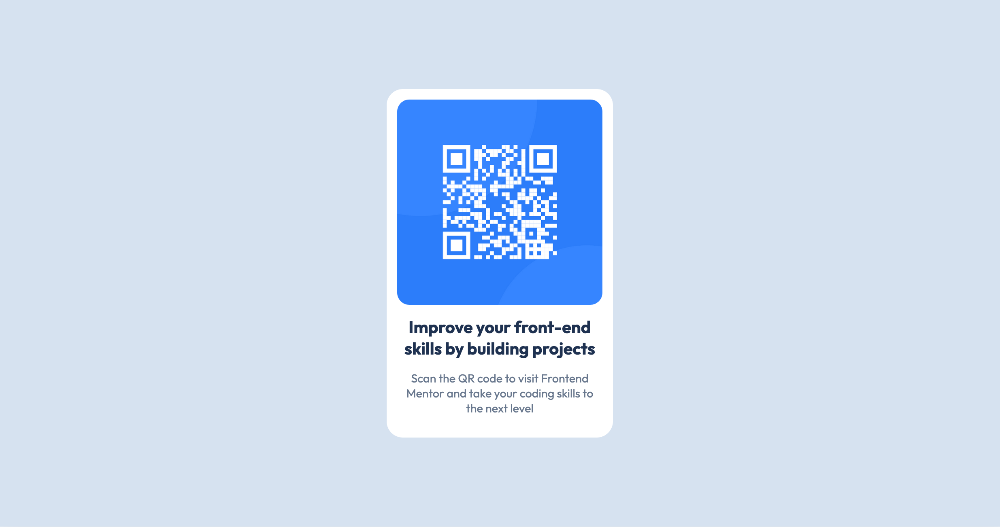

# Frontend Mentor - QR code component solution

This is a solution to the [QR code component challenge on Frontend Mentor](https://www.frontendmentor.io/challenges/qr-code-component-iux_sIO_H). Frontend Mentor challenges help you improve your coding skills by building realistic projects. 

## Table of contents

- [Overview](#overview)
  - [Screenshot](#screenshot)
  - [Links](#links)
- [My process](#my-process)
  - [Built with](#built-with)
  - [What I learned](#what-i-learned)
  - [Useful resources](#useful-resources)
- [Author](#author)


## Overview
this is a frontend mentor challenge the first one and it's mainly based on html and css background

### Screenshot



### Links

- Solution URL: [on my GitHub](https://github.com/yac6n/challenge1.github.io)
- Live Site URL: [live site on Vercel ](https://frontend-mentor-challenge1-three.vercel.app/)

## My process

### Built with

- Semantic HTML5 markup
- CSS Grid


### What I learned

I learned how to center elements with only the CSS Grid property, and also how to make an image responsive

```css
.container {
    background-color: hsl(212, 45%, 89%);
    text-align: center;
    margin: 10% 5%;
    padding: 8%;
    display: grid;
    place-items: center;
    height: auto;
    box-shadow: 1px 15px 20px rgba(0, 0, 0, 0.1);
}
```

```css
.qr-code-card img {
    display: block;
    width: 100%;
    height: auto;
    border-radius: 15px;
}
```

### Useful resources

- [W3 school](https://www.w3schools.com/css/css_grid.asp) - This helped me understanding css grid. I really liked this pattern and will use it going forward.

## Author

- GitHub - [yac6n](https://github.com/yac6n)
- Frontend Mentor - [yac6n](https://www.frontendmentor.io/profile/yac6n)

